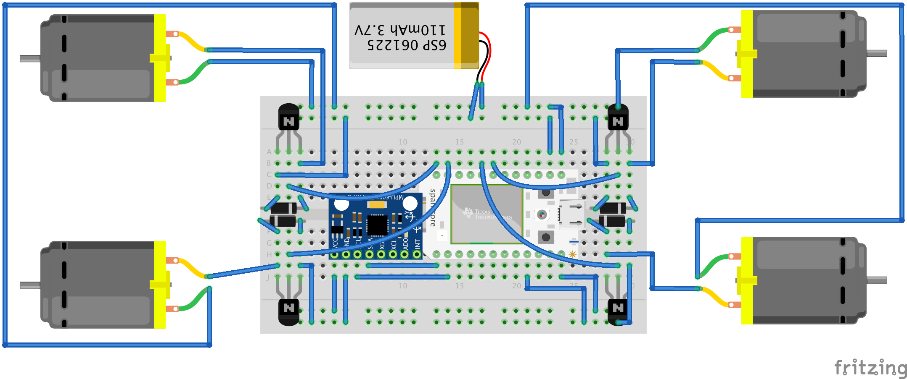
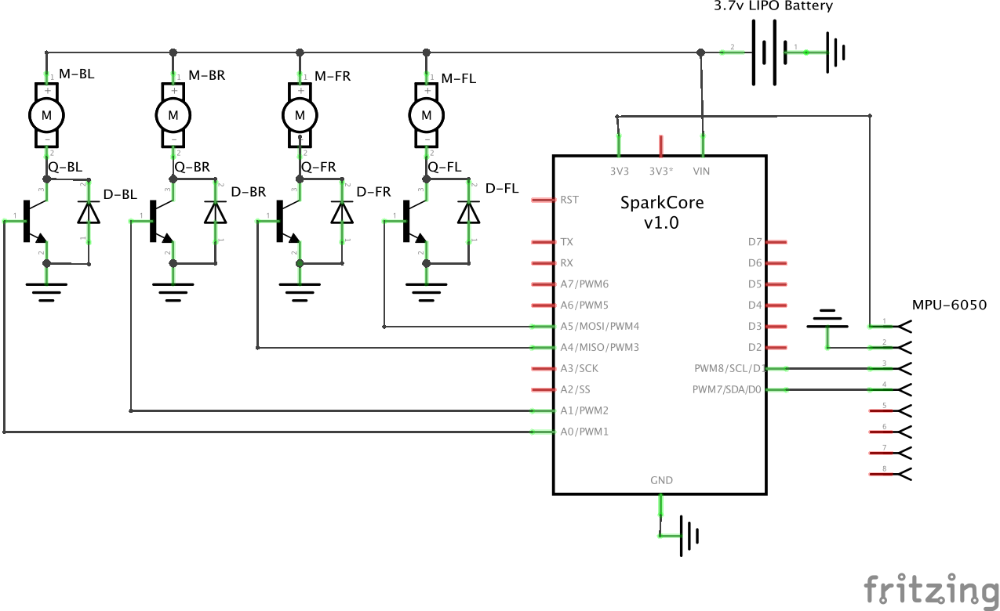

Spark Core Quadcopter
=====================

Firmware and designs for a from-scratch [Spark Core](http://spark.io) based quadcopter. Currently a work in progress

Contents
--------

-   [Components](#components)
    -   [Spark Core](#spark-core)
    -   [MPU-6050 Sensor](#mpu6050-sensor)
    -   [Hubsan X4 Motors](#hubsan-x4-motors)
    -   [3.7v LIPO Battery](#37v-lipo-battery)
    -   [3D Printed Frame](#3d-printed-frame)
-   [Schematics](#schematics)
    -   [Breadboard Layout](#breadboard-layout)
    -   [Circuit Diagram](#circuit-diagram)
-   [Firmware](#firmware)
    -   [Core Modules](#core-modules)
    -   [Links](#links)

Components
----------

### Spark Core

The brains of the quadcopter, reads user input over wi-fi and sensor input from the MPU-6050, and adjusts motors accordingly. A Spark Photon should also work in place of a Spark Core.

-   [Website](http://spark.io)
-   [Documentation](http://spark.io/firmware)

### MPU-6050 Sensor

The MPU-6050 is a 6-axis motion sensing chip, which contains both an accelerometer and a gyroscope. The GY-521 breakout board makes it easy to connect this sensor to the Spark Core.

-   [GY-521 Guide](http://playground.arduino.cc/Main/MPU-6050)
-   [MPU-6050 Specifications](http://www.invensense.com/mems/gyro/documents/PS-MPU-6000A-00v3.4.pdf)
-   [Spark Core `Wire` docs](http://docs.spark.io/firmware/#communication-wire)
-   Pinouts
    -   SDA <-> Spark Core D0
    -   SCL <-> Spark Core D1

### Hubsan X4 Motors

Small, lightweight 3.7v DC motors to provide lift and control. These motors are easy to find since they are used in the Hubsan X4 quadcopter. Inexpensive plastic propellers are available which attach directly to the motors.

-   [Purchase motors on Amazon](http://www.amazon.com/Hubsan-Mini-Quadcopter-Spare-Motor/dp/B00B3RO0GE)
-   [Purchase propellers on Amazon](http://www.amazon.com/gp/product/B00GZHI75C)
-   [Specifications & Performance Data](http://www.rcgroups.com/forums/showthread.php?t=2009496)
-   [Motor control guide](ttps://itp.nyu.edu/physcomp/labs/motors-and-transistors/using-a-transistor-to-control-high-current-loads-with-an-arduino)
-   [Spark Core `analogWrite` docs](http://docs.spark.io/firmware/#i-o-analogwrite)
-   Variants
    -   Clockwise - Red + / Blue -
    -   Counter-clockwise - White + / Black -

### 3.7v LIPO Battery

Lightweight LIPO battery to power both the Spark Core and DC motors.

-   [Purchase on Amazon](http://www.amazon.com/gp/product/B00HS5Y6G4/)

### 3D Printed Frame

-   TODO

Schematics
----------

### Breadboard Layout

### Circuit Diagram

Firmware
--------

### Core Modules

-   Sensor reading: Read values from gyroscope and accelerometer
-   Control inputs: Read simple commands from the network
-   Motor control: Adjust motor speeds based on sensor values and control inputs

### Links

-   [Quadcopter guide](https://ghowen.me/build-your-own-quadcopter-autopilot/)
